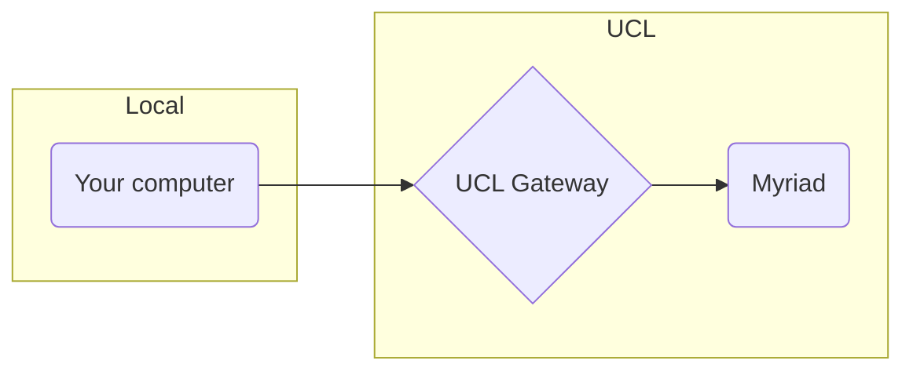

# ssh

## Overview
In directory `~/.ssh`:
- Create an ssh config file ([[ssh#config]])
- Generate ssh keys and upload to remote servers ([[ssh#keys]])



## config

Create `~/.ssh/config` (updating `<TEXT_TO_REPLACE>`):

```
# UCL's gateway node
Host UclSshGateway
  IdentityFile ~/.ssh/ucl_key
  User <UCL_USERNAME>
  HostName ssh-gateway.ucl.ac.uk

# UCL's Myriad HPC server
Host myriad
  IdentityFile ~/.ssh/ucl_key
  User <UCL_USERNAME>
  HostName myriad.rc.ucl.ac.uk
  proxyCommand ssh -W myriad.rc.ucl.ac.uk:22 UclSshGateway

# For ineracting with GitHub
Host github.com
  Hostname ssh.github.com
  Port 443
  IdentityFile ~/.ssh/github_key

# Store ssh key passwords securely
Host *
  AddKeysToAgent yes
  UseKeychain yes
```

## keys

Create ssh keys, e.g. create `ucl_key` from above as follows:

```
ssh-keygen -f ~/.ssh/ucl_key
```

This will generate `ucl_key` and `ucl_key.pub`. The public key now needs to be uploaded to the server

See also:
- https://www.freecodecamp.org/news/the-ultimate-guide-to-ssh-setting-up-ssh-keys/
- https://linuxhandbook.com/add-ssh-public-key-to-server/